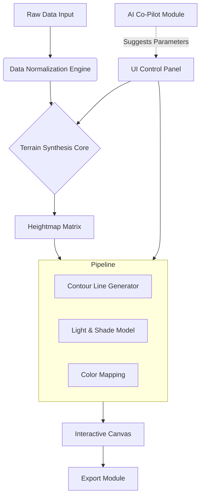

# 🗺️ TopoGraphica: Interactive Terrain Visualization Suite

[](https://audie92.github.io/contour-line-generator/)

## 🌄 Overview: Where Data Becomes Landscape

TopoGraphica transforms abstract datasets into living, breathing topographical landscapes. Imagine your spreadsheets, sensor readings, or mathematical functions not as cold numbers, but as majestic mountain ranges, rolling hills, and deep valleys that you can explore in real-time. This is not merely a visualization tool—it's a spatial reasoning environment where data tells its story through terrain.

Built upon the conceptual foundations of heightmap rendering, TopoGraphica evolves the paradigm into a comprehensive, interactive suite for artists, data scientists, educators, and researchers. It provides an intuitive bridge between quantitative information and qualitative, spatial understanding.

## ✨ Key Features & Capabilities

*   **🌐 Responsive, Immersive Interface:** The canvas adapts fluidly to any display, from desktop monitors to presentation screens. Pan, zoom, and rotate your generated terrain with seamless, intuitive controls.
*   **🗣️ Multilingual Accessibility:** The interface speaks your language. Currently supporting English, Español, Français, Deutsch, and 日本語, with a simple framework for community contributions.
*   **🛠️ Real-Time Parameter Sculpting:** Don't just view—sculpt. Dynamically adjust variables like resolution, vertical exaggeration, line density, shading algorithms, and color gradients. See your changes manifest instantly.
*   **🧠 AI-Powered Terrain Synthesis:** Integrate directly with **OpenAI API** and **Claude API** to generate or modify terrain parameters using natural language prompts (e.g., "Create a terrain with sharp, alpine peaks and a calm lake basin in the center").
*   **📈 Multi-Format Data Ingestion:** Feed it CSV files, JSON structures, real-time serial data, or mathematical functions. TopoGraphica interprets and elevates your data into a spatial model.
*   **🎨 Advanced Rendering Modes:** Toggle between precise contour lines, smooth shaded relief, hybrid views, or experimental artistic filters to highlight different aspects of your data.
*   **🔧 24/7 Automated Guidance System:** An integrated, context-aware help system provides guidance and suggests parameters, functioning as your round-the-clock digital cartographer.

## 🚀 Getting Started: Your First Expedition

### Prerequisites
- **Processing 4+** or compatible environment.
- An internet connection for initial AI feature setup (optional).
- A sense of curiosity.

### Installation & Launch

1.  **Acquire the Application:**
    [](https://audie92.github.io/contour-line-generator/)

2.  **Extract the archive** to your preferred directory.

3.  **Launch TopoGraphica** by opening the `TopoGraphica.pde` file within the Processing IDE.

### Example Console Invocation (Advanced)
For headless rendering or integration into pipelines, use the command-line companion:
```bash
java -jar topographica_cli.jar --input data/sample.csv --mode contours --output render.png --resolution 1920x1080 --palette topographic
```

## 📖 Example Profile Configuration

Create a `config.json` file in the `/settings` directory to personalize your experience. Here is a sample configuration:

```json
{
  "user_interface": {
    "language": "es",
    "theme": "dark_night",
    "default_zoom": 1.5
  },
  "rendering_engine": {
    "default_mode": "hybrid",
    "line_persistence": 0.85,
    "shadow_intensity": "subtle"
  },
  "ai_integration": {
    "openai_api_key": "your_optional_key_here",
    "claude_api_key": "your_optional_key_here",
    "enable_suggestions": true
  },
  "export_settings": {
    "format": "vector_svg",
    "dpi": 300
  }
}
```

## 🧩 System Architecture

The following diagram illustrates TopoGraphica's modular data flow:



## 📊 Compatibility Matrix

| Operating System | Status | Notes |
| :--- | :--- | :--- |
| **Windows 10/11** | ✅ Fully Supported | Optimized for DirectX rendering. |
| **macOS** (11+) | ✅ Fully Supported | Native Metal API support for silky performance. |
| **Linux** (Ubuntu, Fedora) | ✅ Fully Supported | Community-tested on X11 and Wayland. |
| **ChromeOS** (Linux container) | ⚠️ Experimental | Runs via Linux beta environment. |
| **Raspberry Pi OS** | ⚠️ Basic Functionality | Lower-resolution rendering recommended. |

## 🔑 SEO-Optimized Description for Discovery

TopoGraphica is an **interactive data visualization software** and **creative coding tool** for generating **procedural terrain art** and **scientific heightmaps**. Ideal for **data artists**, **geography educators**, and **researchers** needing **3D data representation**, it enables **real-time parameter manipulation**, **customizable contour mapping**, and **AI-enhanced landscape design**. This **open-source Processing sketch** serves as a powerful **visual analytics platform** and **generative art studio**.

## ⚠️ Disclaimer

TopoGraphica is provided "as-is" for educational, artistic, and research-oriented purposes. The developers assume no liability for any outcome resulting from the use of this software. AI integration features require your own API keys and are subject to the respective terms of service of OpenAI and Anthropic. Data processed by this software remains on your local machine unless explicitly sent via optional AI features.

## 📄 License

This project is licensed under the **MIT License**. This permissive license allows for broad reuse in both personal and commercial projects, with the requirement that the original license and copyright notice are included.

For full details, please see the [LICENSE](LICENSE) file in the repository.

---
### Begin Your Visualization Journey

[](https://audie92.github.io/contour-line-generator/)

© 2026 TopoGraphica Project Contributors.